<div align="center">


# 💰 BudgetAI — AI‑Powered Budget Monitor

**A Streamlit application that turns raw bank/UPI statements into budgets, risk alerts, and AI‑generated financial advice.**

[](https://www.python.org/)
[](https://streamlit.io/)
[](https://pandas.pydata.org/)
[](https://platform.openai.com/)
[]()
[]()

</div>

---

## 📑 Table of Contents

1. [Overview](#-overview)
2. [Problem Statement & Motivation](#-problem-statement--motivation)
3. [Features](#-features)
4. [Product Preview](#-product-preview)
5. [Tech Stack](#-tech-stack)
6. [Folder Structure](#-folder-structure)
7. [Installation](#-installation)
8. [Running the Project](#-running-the-project)
9. [Usage Guide](#-usage-guide)
10. [AI Pipeline](#-ai-pipeline)
11. [System Architecture](#-system-architecture)
12. [Data Flow](#-data-flow)
13. [Known Limitations & Honest Notes](#-known-limitations--honest-notes)
14. [Learning Outcomes](#-learning-outcomes)
15. [Future Improvements](#-future-improvements)
16. [Contributors](#-contributors)
17. [License](#-license)

---

## 🧭 Overview

**BudgetAI** is a multi-page [Streamlit](https://streamlit.io/) app for personal finance monitoring. A user logs in, uploads a bank or UPI statement (CSV/XLSX — sample data is modeled on **PhonePe** UPI exports), and the app:

- Parses and cleans the statement into a normalized transaction table.
- Visualizes spending on an interactive dashboard.
- Scans for suspicious or risky transactions with configurable thresholds.
- Produces budgeting advice — via an LLM (OpenAI) when an API key is configured, or a local rule-based fallback when it isn't.

The codebase lives under **`budget_ai_app/`**: a single Streamlit entry point (`app.py`), four numbered pages under `pages/`, and a small `utils/` package.

> 💡 **Note on the folder name:** the original repo shipped this as `budget_ai_app (1)/` (a leftover from a duplicate download). Rename it to `budget_ai_app/` — it avoids quoting the path on every `cd` and `streamlit run`.

---

## ❓ Problem Statement & Motivation

People generate dozens of small digital transactions every month (UPI payments, card swipes, subscriptions) but rarely get a clear picture of where the money goes — and almost never get a heads-up about an unusual charge until it's too late. Manually reconciling a statement in a spreadsheet is slow, error-prone, and doesn't scale across accounts or months.

BudgetAI's goal: a **single, self-contained tool** — no external database, no backend server — that a student or individual can run locally, drop a statement into, and immediately get a clean transaction view, visual breakdowns, an automated "is this normal?" check, and plain-language budgeting advice, online or offline.

---

## ✨ Features

| Feature | Description |
|---|---|
| 🔐 **Local Authentication** | Sign up / log in via a sidebar form. Credentials in `data/users.json`, SHA-256 hashed (see [limitations](#-known-limitations--honest-notes)). Session state gates every page. |
| 📁 **Statement Upload & Parsing** | Drag-and-drop CSV/XLSX. `utils/budget.py` auto-detects the header row (even with none, or buried a few rows down), tolerates multiple encodings, strips currency symbols (₹, $, commas), and infers debit/credit sign from a `type` column or "Cr/Dr" suffixes. |
| 📊 **Interactive Dashboard** | Transaction count, net spend, and net income metrics; a grouped category summary table; a donut chart of top categories; a monthly net-amount trend line; a recent-transactions table; a financial health score. |
| 🧮 **Expense Analytics** | Category-wise breakdown by amount and share, ranked top-spending categories, and a plain-language nudge on the category to trim next. |
| 🗓️ **Budget Planner** | Per-category budget vs. actual tracking with progress bars, plus rolled-up totals for overall budget, spend, remaining balance, and utilization rate. |
| ⚠️ **Risk Detection** | Estimates monthly income from historical credits, then flags transactions that are: (a) **unaffordable** — a debit above a configurable % of income, (b) a **statistical outlier** via z-score, (c) to a **new/unseen payee**, or (d) part of a **burst of 4+ payments** to one payee within 7 days. Each flag is reviewed (Yes / No / Not sure); "No" offers a local account-freeze flag and an optional Twilio SMS alert, both logged to `logs/freeze_requests.csv`. |
| 🤖 **AI Financial Advisor** | Builds a numeric summary (totals, top categories, top transactions, monthly trend) into a structured prompt, surfacing impact-ranked recommendations. With an `OPENAI_API_KEY` present, calls OpenAI's Chat Completions API (supports both `openai>=1.0` and the legacy SDK) for a markdown action plan. Without a key, or if the call fails, falls back to a deterministic rule-based local analysis — the page never breaks. |
| 🏷️ **Keyword-Based Categorization** | `utils/categorize.py` assigns a category (Food, Transport, Groceries, Travel, Subscriptions, Shopping, Health, Others) via keyword matching on the description — a lightweight, explainable rule engine rather than a trained classifier. |
| 🧾 **Audit Logging** | Every freeze request or SMS attempt is appended to `logs/freeze_requests.csv` with a timestamp for a local audit trail. |

---

## 🖼️ Product Preview

<div align="center">

### Dashboard Overview

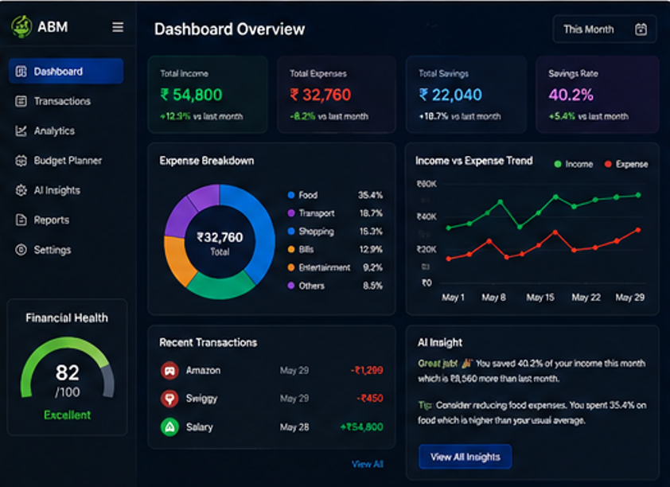

</div>

The dashboard gives users a single, centralized view of financial health — income, expenses, savings, and savings-rate deltas versus the previous month — alongside an expense-breakdown donut, an income-vs-expense trend line, a recent-transactions feed, and an AI-generated insight card that surfaces the single most useful action to take next.

<table>
<tr>
<td width="50%">

### Expense Analytics
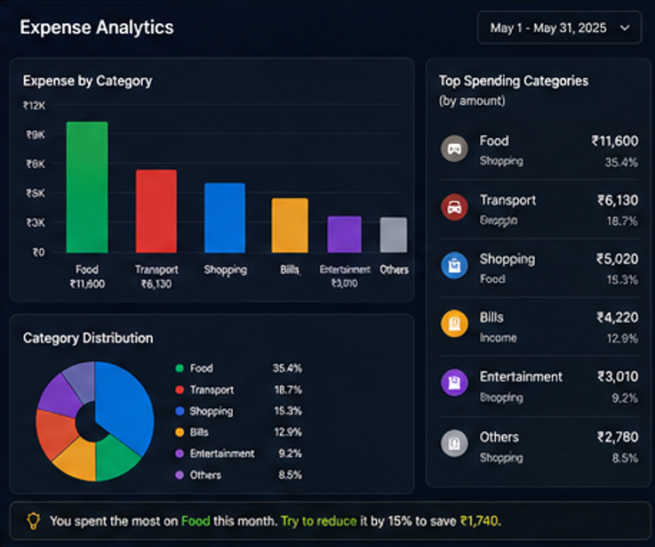

Breaks spending down by category with both a bar chart and a donut, ranks the top spending categories by amount and share, and closes with a one-line, plain-language recommendation (e.g. trimming the largest category by a fixed percentage to hit a savings target).

</td>
<td width="50%">

### AI Recommendations
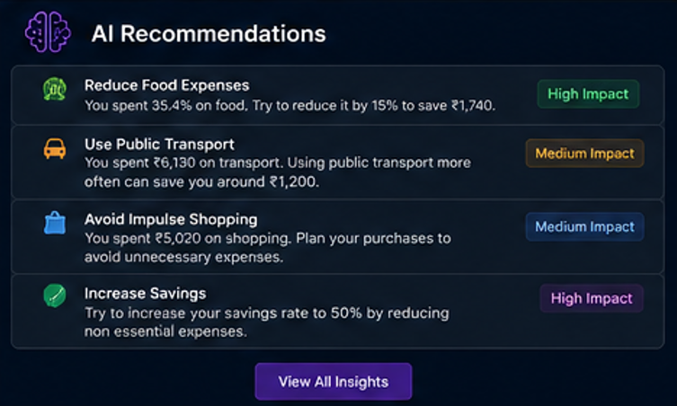

Surfaces the AI Financial Advisor's output as a scannable card list — each recommendation paired with a concrete rupee figure and an impact rating (High / Medium), so users can act on the highest-value suggestion first.

</td>
</tr>
</table>

### Budget Planner

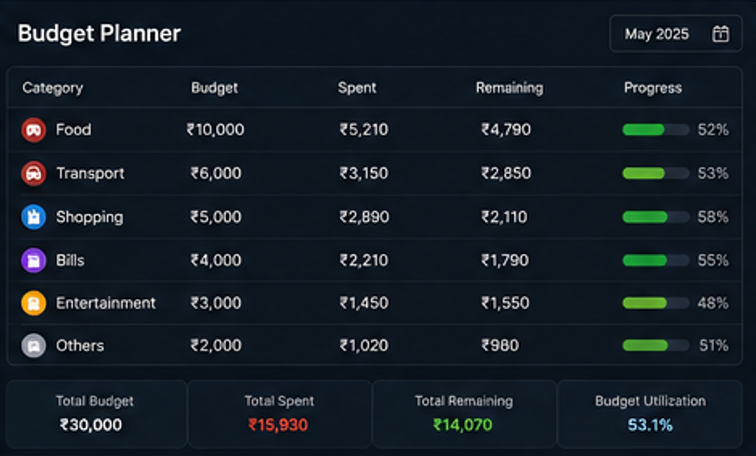

Tracks a monthly budget against actual spend per category, with a progress bar and remaining balance for each line item, plus a rolled-up total budget, total spent, total remaining, and overall budget-utilization percentage for the month.

### Upload Transactions

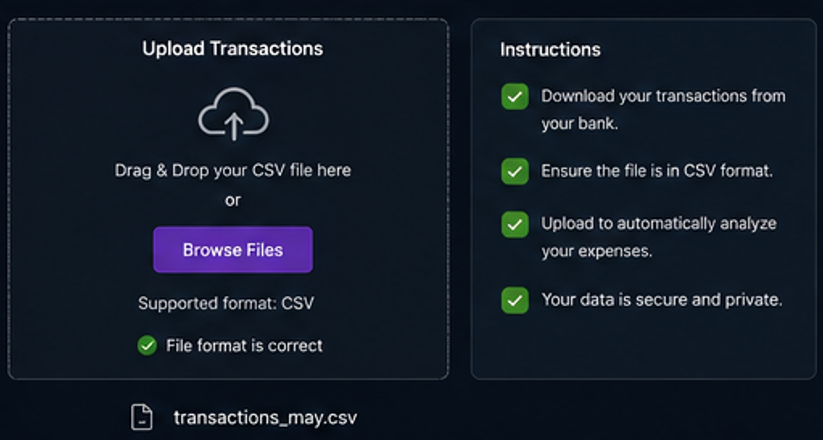

A guided drag-and-drop uploader for CSV statements, paired with plain-language instructions (download from your bank, confirm the CSV format, upload to auto-analyze) and inline validation once a file is detected — reducing the friction of getting a first statement into the app.

---

## 🛠️ Tech Stack

| Layer | Technology |
|---|---|
| UI / App framework | [Streamlit](https://streamlit.io/) (multi-page app via `pages/`) |
| Data processing | [pandas](https://pandas.pydata.org/), [NumPy](https://numpy.org/) |
| Charts | [Matplotlib](https://matplotlib.org/) (donut + line charts) |
| Spreadsheet I/O | [openpyxl](https://openpyxl.readthedocs.io/) |
| Date parsing | [python-dateutil](https://dateutil.readthedocs.io/) |
| AI / LLM | [OpenAI Python SDK](https://github.com/openai/openai-python) (chat completions; v1 and legacy client) |
| Tokenization | [tiktoken](https://github.com/openai/tiktoken) |
| Notifications | [Twilio](https://www.twilio.com/) SMS (optional) |
| Auth storage | Local JSON (`data/users.json`), SHA-256 via `hashlib` |
| Language | Python 3.9+ |

---

## 🗂️ Folder Structure


```text
budget_ai_app/
├── app.py                          # Entry point: auth gate + welcome/summary
├── requirements.txt
├── data/
│   ├── users.json                  # Local user store (username + SHA-256 hash)
│   ├── sample_statement.csv        # Example transactions
│   ├── large_sample_statement.xlsx # Example Excel statement
│   └── *PhonePe_Statement*.csv     # Real-world UPI export samples
├── pages/
│   ├── 1_📁_Upload_Transactions.py
│   ├── 2_📊_Dashboard.py
│   ├── 3_⚠️_Risk_Detection.py
│   └── 4_🤖_AI_Financial_Advisor.py
└── utils/
    ├── budget.py         # Statement parser / cleaner
    ├── categorize.py     # Keyword-rule transaction categorizer
    ├── risk.py           # Income estimate + anomaly detection
    ├── ai_advisor.py     # OpenAI prompt builder + local fallback
    ├── auth.py           # Signup / login / session handling
    ├── logger.py         # CSV audit log for freeze/SMS events
    └── notify.py         # Twilio SMS helper
```

> 📌 The product preview above reflects the current in-app experience, including the Expense Analytics and Budget Planner views. If your working copy hasn't split those into their own files under `pages/` yet, this is a good checklist for the next refactor.

---

## 💻 Installation

<details open>
<summary><b>🪟 Windows</b></summary>

```powershell
git clone https://github.com/Rakhal06/ABM-AI-Powered-Budget-Monitor.git
cd ABM-AI-Powered-Budget-Monitor\budget_ai_app

python -m venv venv
venv\Scripts\activate

pip install -r requirements.txt
```
</details>

<details>
<summary><b>🐧 Linux / 🍎 macOS</b></summary>

```bash
git clone https://github.com/Rakhal06/ABM-AI-Powered-Budget-Monitor.git
cd ABM-AI-Powered-Budget-Monitor/budget_ai_app

python3 -m venv venv
source venv/bin/activate

pip install -r requirements.txt
```
</details>

**`requirements.txt`:**

```text
streamlit
pandas
numpy
matplotlib
openpyxl
python-dateutil
openai
tiktoken
twilio      # optional — only needed for the SMS alert feature
```

---

## ▶️ Running the Project

From inside `budget_ai_app/`:

```bash
streamlit run app.py
```

Streamlit opens the app in your browser (default `http://localhost:8501`). Use the sidebar to sign up or log in, then navigate between pages via the auto-generated page menu.

### Optional environment variables

| Variable | Used by | Purpose |
|---|---|---|
| `OPENAI_API_KEY` | AI Financial Advisor | Enables LLM-generated advice instead of the local rule-based fallback |
| `TWILIO_ACCOUNT_SID`, `TWILIO_AUTH_TOKEN`, `TWILIO_FROM`, `TWILIO_TO` | Risk Detection | Enables the optional SMS alert on flagged transactions |

Set these as environment variables or in `.streamlit/secrets.toml` (**do not commit this file**):

```toml
OPENAI_API_KEY = "sk-..."
TWILIO_ACCOUNT_SID = "AC..."
TWILIO_AUTH_TOKEN = "..."
TWILIO_FROM = "+1..."
TWILIO_TO = "+91..."
```

---

## 📘 Usage Guide

### 1. Sign up / Log in
Use the sidebar to create an account, then log in with the same credentials.

### 2. Upload a statement


**📁 Upload Transactions** — drag in a CSV or XLSX file. The app parses it with `utils.budget.read_statement()` and stores the result in `st.session_state["transactions_df"]`. If parsing fails, a raw preview and a header-fix hint are shown instead.

### 3. Explore the Dashboard


**📊 Dashboard** — transaction/spend/income metrics, a top-categories table, a category donut chart, a monthly trend line, and a financial-health score, all computed live from the session's data.

### 4. Dive into Expense Analytics


**🧮 Analytics** — a category-level bar chart and donut, ranked top spending categories, and a targeted tip on where to cut back this month.

### 5. Set a Budget


**🗓️ Budget Planner** — set a per-category budget, track spend against it with a live progress bar, and see remaining balance and overall utilization at a glance.

### 6. Run a Risk Scan


**⚠️ Risk Detection** — tune three thresholds (unaffordable %, outlier z-score, payee lookback window) and run a scan. Mark each flag authorized or not; "No" surfaces a local freeze action and an optional SMS alert.

> Mockup reconstructed from the Streamlit source, not a live screenshot — it reflects the actual widgets, layout, and messages implemented in the page.

### 7. Ask the AI Advisor


**🤖 AI Financial Advisor** — ask a free-text question, pick a model, toggle "deep" mode for a longer analysis. Recommendations render as impact-ranked cards backed by a full markdown response, with optional category and monthly charts.

---

## 🧠 AI Pipeline

The "AI" here is implemented in two distinct, honestly-scoped ways:

1. **Rule-based categorization** (`utils/categorize.py`) — a deterministic keyword matcher (e.g. "uber"/"ola" → Transport, "zomato"/"swiggy" → Food) with an "Others" catch-all. Not a trained model.
2. **LLM-based advisory** (`utils/ai_advisor.py`) — the actual generative-AI component:
   - `_summarize_data()` reduces the DataFrame to totals, income/expense, top categories, top transactions, and a monthly trend.
   - `_build_prompt()` turns that summary into a structured prompt asking for a 5-part markdown response (summary, root-cause analysis, action plan, direct answer, quick wins).
   - `_call_llm()` sends the prompt to OpenAI's Chat Completions endpoint, supporting both the modern and legacy SDKs.
   - If no key is configured, or the call raises an exception, `_local_rule_based_advice()` produces an equivalent non-LLM markdown report from the same summary.

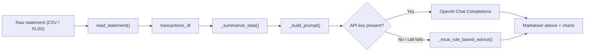

---

## 🏗️ System Architecture

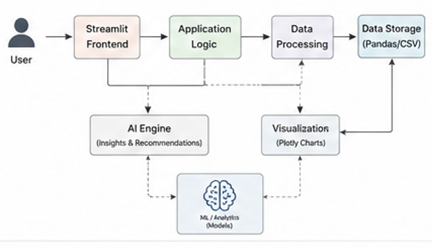

At a high level, the Streamlit frontend hands user actions to the application logic layer, which routes data through processing and storage while the AI engine (backed by ML/analytics models) and the visualization layer both read from — and feed back into — that same data pipeline.


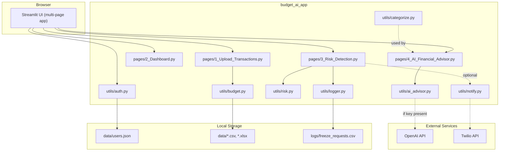

---

## 🔄 Data Flow

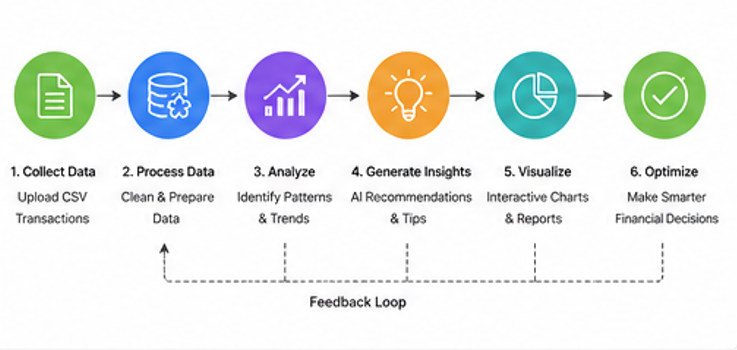

The pipeline runs as a loop rather than a one-shot script: raw data is collected and processed, patterns are analyzed into insights, those insights are visualized back to the user, and the resulting decisions feed the next upload cycle.

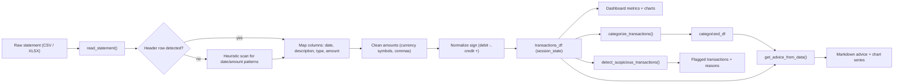

---

## ⚠️ Known Limitations & Honest Notes

- **Committed credentials:** `data/users.json` is tracked in version control with real-looking usernames and SHA-256 hashes. Hashes are one-way, but a committed live user store is bad practice — remove it from git history and add it to `.gitignore`.
- **No salt on password hashing:** `utils/auth.py` uses plain `hashlib.sha256`, vulnerable to rainbow-table attacks. Use a salted algorithm (`bcrypt`/`argon2`) for anything beyond a demo.
- **Freeze account is local-only:** it does not call any bank or payment provider API. The UI is explicit about this, which is good — but worth restating: use it as an informational flag, not a real freeze.
- **PDF upload advertised but not implemented:** the home page mentions "CSV/Excel/PDF," but `utils/budget.read_statement()` only handles `.csv`, `.xls`, `.xlsx`.
- **No automated tests or CI** exist yet.
- **Debug print in the AI Advisor page** — harmless, but should be removed before a public demo.

None of the above block a demo/MVP — they're the natural punch-list from prototype to production.

---

## 🎓 Learning Outcomes

- Building a **multi-page Streamlit app** with shared session state across pages.
- Writing a **defensive, heuristic data parser** for inconsistently formatted financial exports.
- Designing a **graceful-degradation AI feature** that works whether or not an external API key is available.
- Implementing basic **statistical anomaly detection** (z-scores, thresholding, sliding-window frequency checks).
- Integrating a **third-party notification API** (Twilio) behind optional, credential-gated code paths.
- Practicing **local, file-based authentication** and session-state gating in a single-process app.

---

## 🚀 Future Improvements

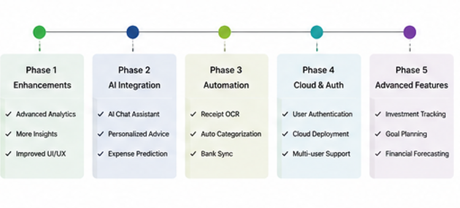

| Phase | Focus | Planned Items |
|---|---|---|
| **1 — Enhancements** | Sharpen what already exists | Advanced analytics, more insights, improved UI/UX |
| **2 — AI Integration** | Deepen the AI layer | AI chat assistant, more personalized advice, expense prediction, a more capable multi-turn LLM assistant with memory of past advice |
| **3 — Automation** | Cut manual data entry | Receipt OCR ingestion, auto-categorization, bank sync, native PDF statement parsing (to match what the UI already advertises) |
| **4 — Cloud & Auth** | Production-ready foundations | Real authentication (salted, backed by a proper database), containerized cloud deployment with managed secrets, multi-user support |
| **5 — Advanced Features** | Grow beyond budgeting | Investment tracking alongside spending/budgeting, goal planning, financial forecasting models, a scalable backend that separates parsing/risk/AI logic from the Streamlit UI layer |

---


## 📄 License

This project is licensed under the [MIT License](https://choosealicense.com/licenses/mit/) — add a `LICENSE` file to the repo root with the MIT text to make this official.

---

## 📬 Contact

Questions or issues → open one on the repo: **[github.com/Rakhal06/ABM-AI-Powered-Budget-Monitor](https://github.com/Rakhal06/ABM-AI-Powered-Budget-Monitor)**
