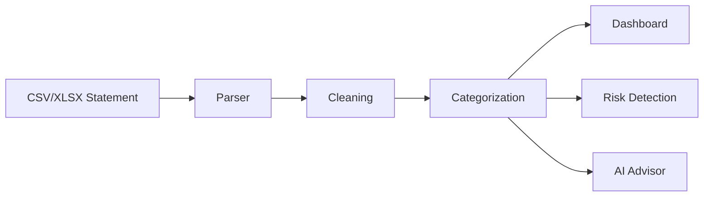

# 💰 BudgetAI — AI-Powered Personal Budget Monitor

> **Transform raw bank and UPI statements into actionable financial insights with AI-powered budgeting, analytics, and risk detection.**


---

## 📌 Overview

BudgetAI is a **multi-page Streamlit application** that helps users understand their financial habits by analyzing bank and UPI statements.

The application provides:

- 📊 Interactive dashboards
- 🧮 Expense analytics
- 🗓 Budget planning
- ⚠️ Risk detection
- 🤖 AI-powered financial advice

This project was developed as a rapid MVP within **24 hours** and is designed to be expanded into a production-ready intelligent finance platform.

---

# ✨ Features

- Secure local authentication
- CSV/XLSX transaction upload
- Automatic transaction categorization
- Interactive dashboard
- Monthly expense analytics
- Budget planner
- Suspicious transaction detection
- AI financial advisor
- Local audit logging

---

# 🖼 Product Preview

## Dashboard Overview


---

## Expense Analytics


---

## AI Recommendations


---

## Budget Planner


---

## Upload Transactions


---

# 🏗 System Architecture


The application consists of a Streamlit frontend, modular business logic, data-processing utilities, analytics engine, AI recommendation module, and visualization layer.

---

# 🔄 Data Pipeline




---

# 🚀 Future Roadmap


- AI Chat Assistant
- OCR Receipt Scanning
- Bank API Integration
- Investment Tracking
- Financial Forecasting
- Cloud Deployment
- Multi-user Support

---

# 🛠 Tech Stack

| Layer | Technologies |
|--------|--------------|
| Frontend | Streamlit |
| Language | Python |
| Data | Pandas, NumPy |
| Charts | Matplotlib |
| Excel | openpyxl |
| AI | OpenAI API |
| Notifications | Twilio |

---

# 📂 Repository Structure

```text
ABM-AI-Powered-Budget-Monitor/
│
├── README.md
├── app.py
├── requirements.txt
├── assets/
│   ├── screenshots/
│   └── diagrams/
├── pages/
├── utils/
└── data/
```

---

# ⚙ Installation

```bash
git clone https://github.com/Rakhal06/ABM-AI-Powered-Budget-Monitor.git

cd ABM-AI-Powered-Budget-Monitor

python -m venv venv

# Windows
venv\Scripts\activate

pip install -r requirements.txt

streamlit run app.py
```

---

# 💡 Usage

1. Login or create an account.
2. Upload a CSV/XLSX statement.
3. Explore dashboards.
4. Review spending analytics.
5. Create budgets.
6. Run risk detection.
7. Ask the AI Financial Advisor for recommendations.

---

# 🎯 Learning Outcomes

- Multi-page Streamlit development
- Financial data processing
- Rule-based analytics
- AI integration
- Data visualization
- Modular Python architecture

---

# ⚠ Known Limitations

- Local JSON authentication
- Prototype architecture
- CSV/XLSX support only
- No persistent cloud database

---

# 🌱 Future Scope

- Cloud deployment
- OCR support
- Real banking APIs
- Smarter AI insights
- Investment portfolio analytics

---

# 📄 License

MIT License

---

# 👨‍💻 Author

**B. Rakhal Krishna**

- GitHub: https://github.com/Rakhal06
- Email: b.rakhalkrishna06@gmail.com

If you found this project useful, consider giving it a ⭐ on GitHub.
